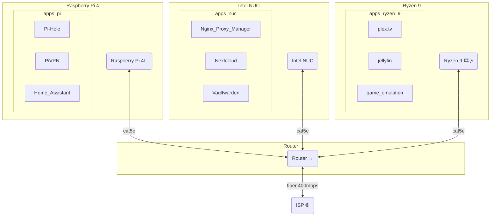

## Network Routing

## Pi4 (Debian 11 Bullseye 64bit)
- [Glances](📁developer/Home%20Lab%20🏠/Glances.md)
- [Pi-hole](📁developer/Home%20Lab%20🏠/Pi-hole.md)
	- Unbound DNS
	- DHCP list
- [PiVPN](📁developer/Home%20Lab%20🏠/PiVPN.md)
	- .config files for each client
- [DuckDNS](📁developer/Home%20Lab%20🏠/DuckDNS.md)
- [Home Assistant](📁developer/Home%20Lab%20🏠/Home%20Assistant.md)
- [Hyperion](📁developer/Home%20Lab%20🏠/Hyperion.md)

---
## Icicle - Intel NUC (Debian 11 Bullseye 64bit)
- [Glances](📁developer/Home%20Lab%20🏠/Glances.md)
- [Duplicati](📁developer/Home%20Lab%20🏠/Duplicati.md)
- [SFTP](📁developer/Home%20Lab%20🏠/SFTP.md)
- [Docker](📁developer/Home%20Lab%20🏠/Docker.md)
	- [Nextcloud](📁developer/Home%20Lab%20🏠/Nextcloud.md)
	- [Nginx Proxy Manager](📁developer/Home%20Lab%20🏠/Nginx%20Proxy%20Manager.md)
	- [Nginx Proxy Manager](📁developer/Home%20Lab%20🏠/Nginx%20Proxy%20Manager.md)
	- [vaultwarden](📁developer/Home%20Lab%20🏠/vaultwarden.md)
	- [Wordpress](📁developer/Home%20Lab%20🏠/Wordpress.md)
	- [ReactJS](📁developer/Home%20Lab%20🏠/ReactJS.md)
	- [NextJS](📁developer/Home%20Lab%20🏠/NextJS.md)
	- [portainer](📁developer/Home%20Lab%20🏠/portainer.md)

---
## Spearmint - (custom PC) (Linux Mint)
- [Glances](📁developer/Home%20Lab%20🏠/Glances.md)
- [Duplicati](📁developer/Home%20Lab%20🏠/Duplicati.md)
- [Docker](📁developer/Home%20Lab%20🏠/Docker.md)
	- [Plex.tv](📁developer/Home%20Lab%20🏠/Plex.tv.md)
	- [Jellyfin](📁developer/Home%20Lab%20🏠/Jellyfin.md)
	- [portainer](📁developer/Home%20Lab%20🏠/portainer.md)
- [XMRig](📁developer/Home%20Lab%20🏠/XMRig.md)
- [SAMBA](📁developer/Home%20Lab%20🏠/SAMBA.md)

---
## Frostbyte
- [Duplicati](📁developer/Home%20Lab%20🏠/Duplicati.md) 
- FL Studio
- Davinci Resolve
- Unity3D
- Steam, Epic Games, Battle.net
- [Thunderbird — Make Email Easier. — Thunderbird](https://www.thunderbird.net/en-US/)

---
## Sn0flake
- [Duplicati](📁developer/Home%20Lab%20🏠/Duplicati.md)
- Serato
- [Hyperion](📁developer/Home%20Lab%20🏠/Hyperion.md)
- Unity3D

---
## Milkywave
- [Nextcloud](📁developer/Home%20Lab%20🏠/Nextcloud.md)
- [SAMBA](📁developer/Home%20Lab%20🏠/SAMBA.md)
- [K-9 Mail (k9mail.app)](k9mail.app)))

---
#todo
- [ ] Pi4 - backup-dd-n-shrink.sh
- [ ] Zip instead of pi-shrink
- [ ] Pi4 - backup.sh
- [ ] Add hyperion into the mix
- [ ] tryout jellyfin in home assistant integration 

[Obsidian Publish with NextJS](📁developer/Projects📐/Obsidian%20Publish%20with%20NextJS.md)
[Nginx Proxy Manager](📁developer/Home%20Lab%20🏠/Nginx%20Proxy%20Manager.md)
[Melt & Murder](📁music/Split%20Skream/Melt%20&%20Murder.md)

## wiki links 
[NextJS](📁developer/Home%20Lab%20🏠/NextJS.md) 

[Obsidian Publish with NextJS](📁developer/Projects📐/Obsidian%20Publish%20with%20NextJS.md)
[In Flavor](myVault/%F0%9F%9A%BFshower_thoughts/In%20Flavor.md)  
[Home Lab 🏠](📁developer/Home%20Lab%20🏠/Home%20Lab%20🏠.md)