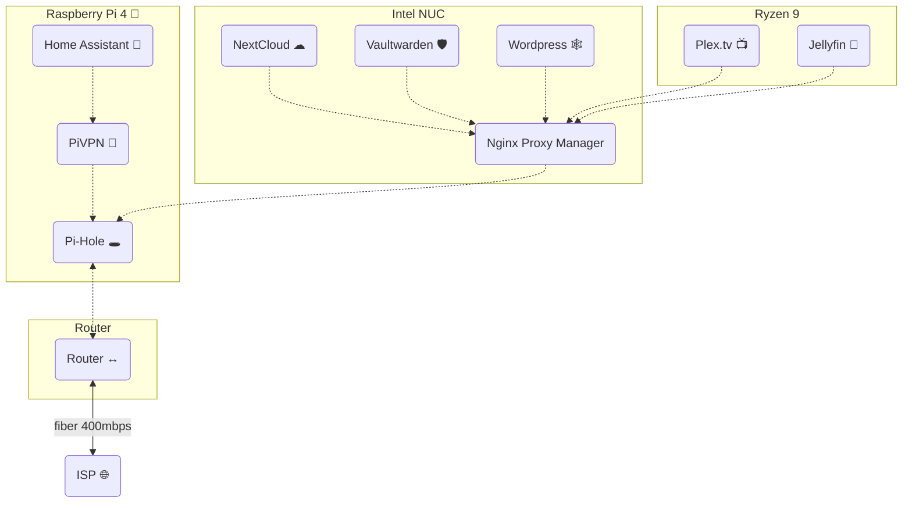

> Expose your services easily and securely [https://nginxproxymanager.com/](https://nginxproxymanager.com/)

Gotta be honest, writing Nginx code was always a headache, but once I found this I never want to go back. This makes **routing**  **SSL** certificates, and **websockets** a breeze.  

---

## App Network Routing


### connections
- [Pi-hole](📁developer/Home%20Lab%20🏠/Pi-hole.md) for local DNS. Make pretty URLs for local or public services

### installation
1. `compose.yml` via [Docker](📁developer/Home%20Lab%20🏠/Docker.md) 
```yaml
version: '3'
services:
  app:
    image: 'jc21/nginx-proxy-manager:latest'
    restart: unless-stopped
    ports:
      - '80:80'
      - '81:81'
      - '443:443'
    volumes:
      - ./data:/data
      - ./letsencrypt:/etc/letsencrypt
```

Default Admin User:
```
Email:    admin@example.com
Password: changeme
```

---

## Publicly Facing Apps
1. [WilliaMusic.com](📁developer/Projects📐/WilliaMusic.com.md)
2. [Nextcloud](📁developer/Home%20Lab%20🏠/Nextcloud.md)
3. [heart-chart](📁developer/Projects📐/heart-chart.md)
4. [vaultwarden](📁developer/Home%20Lab%20🏠/vaultwarden.md)
5. [PhotoPrism](📁developer/Home%20Lab%20🏠/PhotoPrism.md)
6. [Plex.tv](📁developer/Home%20Lab%20🏠/Plex.tv.md)
7. [Jellyfin](📁developer/Home%20Lab%20🏠/Jellyfin.md)

## Pretty URLs for Local Apps
1. [Pi-hole](📁developer/Home%20Lab%20🏠/Pi-hole.md) DNS setup
2. **Nginx** to link Port number 

## Leveraging Docker's Internal DNS routing
for example [vaultwarden](📁developer/Home%20Lab%20🏠/vaultwarden.md) I do *not* specify a `port` number. instead I use the `container_name: vaultwarden` as a DNS entry I can use in **Nginx Proxy Manager** 

---

#todo 
- [ ] explain how you set up router to forward port 80 & 443
- [ ] explain using domain name and IP address
- [ ] show how to connect pi-hole to give any service a pretty URL
- [ ] finish "publicly facing app"
- [ ] finish "pretty urls for ..."