### LANs
- Local Area Networks
	- group devices in same broadcast domain

### VLANs
- Virtual Local Area Networks
	- group of devices in same broadcast domain
	- separated logically instead of physically

### Configuring VLANs
- 1 physical switch separated into 3 VLANs

#### multiple switches
- lots of overhead and uses up many ports.
- possible but not practical

### VLAN Trunking
- send multiple VLANs across one trunk
- much less cabling

- Normal Ethernet frame
| preamble | SFD | Destination MAC | Source MAC | Type | PAYLOAD | FCS |
| -------- | --- | --------------- | ---------- | ---- | ------- | --- |

- add VLAN header in frame
| preamble | SFD | Destination MAC | Source MAC | VLAN* | Type | PAYLOAD | FCS |
| -------- | --- | --------------- | ---------- | ---- | ------- | --- | --- |

#### VLAN IDs
- 12 bits long, 4,095 VLANs
- Normal Range: 1 - 1005
- Extended Range: 1006 - 4094
- 0 & 4,095 are reserved VLAN numbers

### working with Data & Voice

```mermaid
graph LR

pc("PC 💻")
phone("VoiP ☎")
switch("switch 🔃")

pc --> phone
phone --> switch

```

- modern configurations put 
	- VoiP on 1st VLAN
	- Computer on 2nd VLAN 