## [Install Hyperion | Hyperion (hyperion-project.org)](hyperion-project.org))

### connections
- [WLED](%F0%9F%93%81developer/Home%20Lab%20%F0%9F%8F%A0/WLED.md)
- [Home Assistant](%F0%9F%93%81developer/Home%20Lab%20%F0%9F%8F%A0/Home%20Assistant.md)

## Hardware
| device                              | link                                                                                                                                                                                                                                                                                                                                                                                                                                                                                                                                                                    | price |
| ----------------------------------- | ----------------------------------------------------------------------------------------------------------------------------------------------------------------------------------------------------------------------------------------------------------------------------------------------------------------------------------------------------------------------------------------------------------------------------------------------------------------------------------------------------------------------------------------------------------------------- | ----- |
| pi4 4gb                             | [link](https://www.raspberrypi.com/products/raspberry-pi-4-model-b/)                                                                                                                                                                                                                                                                                                                                                                                                                                                                                                    | ???      |
| pi power supply                     | [link](https://www.pishop.us/product/raspberry-pi-15w-power-supply-us-white/)                                                                                                                                                                                                                                                                                                                                                                                                                                                                                           | $8    |
| LED Strip WS2812B 5v 5050 1m 60leds | [link](https://www.ebay.com/itm/293964176660)                                                                                                                                                                                                                                                                                                                                                                                                                                                                                                                           | $10   |
| 2 hdmi cables                       | [link](https://www.ebay.com/itm/234713980767?epid=24021682995&hash=item36a60b1f5f%3Ag%3A1A4AAOSwrmRjH0VE&amdata=enc%3AAQAHAAAAoEHVccqiy1s76PSgwqtERh2Hmt1%2Fe0dwOSK3PNb7NP4DGASrP3ya61rMoCSPLIhpwvqez8%2FOPo8Y1tWbWtoB9B%2FRYIbu6zRmL6N4RSYHb3vgfssBswryHq0rV5z6JmvXpMZBGSGH1M%2BL9UZngaAWl94Uo%2BQgC1IT%2F6kzqEYrh%2BY1DR7PeV7BBScVltvwoiHPZTugTM6%2BcxcuOIVhLwvmrOM%3D%7Ctkp%3ABk9SR_6k96f5YA&LH_ItemCondition=3)                                                                                                                                                     |       |
| HDMI Switch 5 in / 1 out            | [link](https://www.ebay.com/itm/234713980767?epid=24021682995&hash=item36a60b1f5f%3Ag%3A1A4AAOSwrmRjH0VE&amdata=enc%3AAQAHAAAAoEHVccqiy1s76PSgwqtERh2Hmt1%2Fe0dwOSK3PNb7NP4DGASrP3ya61rMoCSPLIhpwvqez8%2FOPo8Y1tWbWtoB9B%2FRYIbu6zRmL6N4RSYHb3vgfssBswryHq0rV5z6JmvXpMZBGSGH1M%2BL9UZngaAWl94Uo%2BQgC1IT%2F6kzqEYrh%2BY1DR7PeV7BBScVltvwoiHPZTugTM6%2BcxcuOIVhLwvmrOM%3D%7Ctkp%3ABk9SR_6k96f5YA&LH_ItemCondition=3)                                                                                                                                                     | ~$50  |
| HDMI Capture Card                   | [link](https://www.ebay.com/itm/313947404440?hash=item4918b93898:g:5pAAAOSwzcZiTuAy&amdata=enc%3AAQAHAAABICSDWJ6Prae9kaIAAzHpZk8qXn%2FJBjZeP1aLAyyshfsQef5CfVfngcMkSdkTTCOaOWoQiMhTcAhl%2BdAqmKBs4BsDw%2B8R%2B7P1UIVOj%2FEtrrKvLFs1ICviarF%2B9RjVdUcTFFOUMpTjZ42dObEFvyDLAs%2BgfECswTZyi7P6gea6uTxiY7T6KeJ%2BuHjsrmUiFdNn1K%2BY7O3ZGOctjsyRyeLWddhX0zXcZWRMf%2FUI%2F%2FluIhVA8vz2UAYxWeQ7IWd0fCUfqB5Lpv%2F75Iwx2MAQQRySREUwJqo0o35iFnlzSrjP7I6CzHU8lZ73LJcy91k9kgP2YvutOqVfjsTYtULJ9rW%2FmSTd6nQI1RSMq53ys%2FwdzKx6gDcECnwsZUOgOXpIBuU81A%3D%3D%7Ctkp%3ABk9SR_Tly6j5YA) | $60   |
| WLED Controller                     | [link](https://www.ebay.com/itm/114385522971)                                                                                                                                                                                                                                                                                                                                                                                                                                                                                                                           | $5    |

## Hardware Wire Diagram

```mermaid
flowchart TB

	%% Hardware
	devices(Nintendo Switch, PC, PlayStation, etc.)
	rpi("raspi 🍓") 
	powadp3("Pow Adapter (5v 3a) ⚡")
	vidcc(USB Capture Card video)
	leds("LED Strip 🚨 (5v)")
	wled("WLED controller")
	powadp10("Pow Adapter (5v 10a) ⚡")
	tv("TV 📺")
	switcher(HDMI Video Switcher)

	%% computer
	vidcc -- usb --> rpi
	powadp3 --> rpi
	rpi -. wifi .-> wled
	
	subgraph group 1
		Nintendo_Switch -- hdmi --> switcher
		PC              -- hdmi --> switcher
		PlayStation     -- hdmi --> switcher
		etc             -- hdmi --> switcher
		switcher -- hdmi --> vidcc
		vidcc  -- hdmi loop out --> tv
	end

	subgraph behind tv
		wled --> leds
		powadp10 --> leds
		powadp10 --> wled
	end


	
```

