## [Install Hyperion | Hyperion (hyperion-project.org)](https://docs.hyperion-project.org/en/user/Installation.html)

### connections
- [WLED](WLED.md)
- [Home Assistant](Home%20Assistant.md)

## Hardware
#todo 
- [ ] pi4 4gb
	- [ ] power supply 3a
- [ ] leds used and buy link
- [ ] usb capture card and buy link
- [ ] power supply 5v 10a
- [ ] 2 hdmi cables
- [ ] wled chip
- [ ] hdmi auto switcher

## Hardware Wire Diagram

```mermaid
flowchart TB

	%% Hardware
	devices(Nintendo Switch, PC, PlayStation, etc.)
	rpi("raspi 🍓") 
	powadp3("Pow Adapter (5v 3a) ⚡")
	vidcc(USB Capture Card video)
	leds("LED Strip 🚨 (5v)")
	wled("WLED controller")
	powadp10("Pow Adapter (5v 10a) ⚡")
	tv("TV 📺")
	switcher(HDMI Video Switcher)

	%% computer
	vidcc -- usb --> rpi
	powadp3 --> rpi
	rpi -. wifi .-> wled
	
	subgraph group 1
		Nintendo_Switch -- hdmi --> switcher
		PC              -- hdmi --> switcher
		PlayStation     -- hdmi --> switcher
		etc             -- hdmi --> switcher
		switcher -- hdmi --> vidcc
		vidcc  -- hdmi loop out --> tv
	end

	subgraph behind tv
		wled --> leds
		powadp10 --> leds
		powadp10 --> wled
	end


	
```

